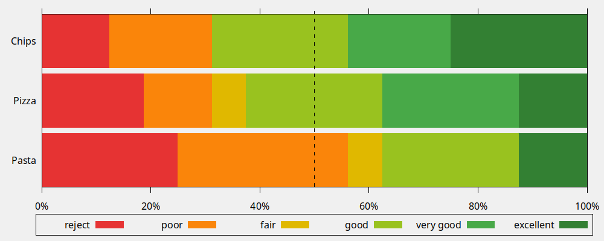

# Majority Judgment CLI tool

> **WORK IN PROGRESS**
> Although the core mechanics are here and ranking does work,
> the features described in this README are not all implemented.
> We're merely doc-driving this tool, and our doc is ambitious.

- [x] Read from stdin with `-`
- [x] Read `CSV` file
- [x] `--sort`
- [x] `--format text`
- [x] `--format json`
- [x] `--format csv`
- [x] `--format yml`
- [x] `--format gnuplot`
- [ ] `--format svg`
- [x] `--chart`
- [x] `--default`
- [ ] `--normalize`

## Download

Hand-made builds are provided in the [Assets of each Release](https://github.com/MieuxVoter/majority-judgment-cli/releases).

## Usage

Say you have a tally CSV like so:

	     , reject, poor, fair, good, very good, excellent
	Pizza,      3,    2,    1,    4,         4,        2
	Chips,      2,    3,    0,    4,         3,        4
	Pasta,      4,    5,    1,    4,         0,        2

You can run

    ./mj example.csv

and get

You probably want to `--sort` the proposals as well:

    ./mj example.csv --sort

or use `-` to read from `stdin`:

    cat example.csv | mj -

### Balancing

Majority Judgment, to stay fair, requires tallies to be balanced ; all proposals must have received the same amount of judgments.

If your tally is not balanced, you may use a default judgment strategy:

    mj example.csv --default 0
    mj example.csv --default excellent
    mj example.csv --default "très bien" --judges 42
    mj example.csv --default majority
    mj example.csv --normalize

The default balancing strategy is to replace missing votes with the "worst", most conservative vote, that is `--default 0`.

### Formats

You can specify the format of the output:

    ./mj example.csv --format json > results.json
    ./mj example.csv --format csv > results.csv
    ./mj example.csv --format yml > results.yml
    ./mj example.csv --format svg > merit.svg

And even format [gnuplot](http://www.gnuplot.info/) scripts that render charts:

    ./mj example.csv --format gnuplot | gnuplot

You can specify the kind of chart you want:

    ./mj example.csv --format gnuplot --chart opinion | gnuplot

Available charts:
- [x] `merit` (default)
- [x] `opinion`
- [ ] `radial`? _(good first issue)_
- [ ] a LOT more would be possible with more detailed data, per participant

## Install

Copy the binary somewhere in your `PATH`.

Or don't, and use it from anywhere.

## Build

You can also grab the source and build it:

    git clone https://github.com/MieuxVoter/majority-judgment-cli

Install [golang](https://golang.org/doc/install).

Example:
- Ubuntu: `sudo snap install go --classic`

Then go into this project directory and run:

    go get
    go build -o mj
    ./mj

### Build distributables

We have a convenience script `build.sh` that will handle version embedding from git,
using the clever `govvv`.

But basically, it's:

    go build -ldflags "-s -w" -o mj

Yields a `mj` binary of about `5 Mio`.

> They say we should not `strip` go builds.

You can run `upx` on the binary to reduce its size:

    upx mj

#### For Windows

    GOOS=windows GOARCH=amd64 go build -ldflags "-s -w" -o mj.exe

Packing the Windows executable with `upx` appears to trigger antivirus software.

